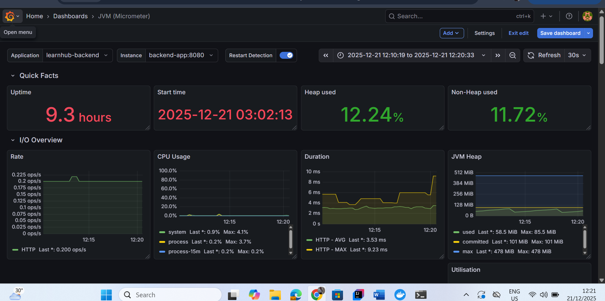

# 🚀 LearnHub - AI-Powered Course Content Platform

**LearnHub** is an enterprise-grade, full-stack course management platform designed to streamline the sharing and consumption of educational materials. It combines robust cloud storage with **Generative AI** to provide instant summaries, key takeaways, and interactive chat capabilities for uploaded content.

---

## 🌐 Live Demo

- **Frontend (Vercel):** [https://course-fronend.vercel.app](https://course-fronend.vercel.app)
- **Backend API (AWS EC2):** `http://13.214.176.196:8080/api/content` *(Replace with your current EC2 IP if different)*

---

## ✨ Key Features

### 🧠 AI-Powered Learning
- **Smart Summaries:** Integrates **Google Gemini AI** to automatically generate concise summaries and key takeaways for PDF documents.
- **AI Chat:** Context-aware chat functionality allows users to ask questions directly related to specific course materials.

### 📂 Robust Content Management
- **Cloud Storage:** Stateless file management using **AWS S3**, supporting large files (up to 100MB).
- **Multi-Format Support:** Seamlessly handles PDFs, Videos (MP4), and Images (PNG/JPG).
- **External Resources:** Support for embedding YouTube videos and external resource links.

### 🔐 Security & Auth
- **Google OAuth2:** One-click secure login/signup via Google Identity Services.
- **JWT Authentication:** Stateless, secure session management with custom expiration settings.
- **Role-Based Access:** Foundation laid for Admin/User separation.

### 🤝 Social Engagement
- **Community Feed:** A real-time feed to discover materials uploaded by peers.
- **Interactive System:** Like, comment, and share functionality to foster collaboration.
- **Real-time Notifications:** Alerts for user interactions.

### 🎨 Modern UI/UX
- **Responsive Design:** Built with React + Vite + Tailwind CSS.
- **Dark Mode:** System-wide dark/light theme toggling with split-screen login visuals.
- **Instant Feedback:** Polished User Experience with React Hot Toast notifications.

---

## 🛠️ Tech Stack

### Backend (Microservices-Ready Architecture)
- **Framework:** Spring Boot 3 (Java 17)
- **Database:** MySQL 8 (Dockerized)
- **Caching:** Redis (Dockerized)
- **ORM:** Hibernate / Spring Data JPA
- **Security:** Spring Security 6, JWT, OAuth2
- **AI Integration:** Google Gemini API
- **Storage:** AWS SDK (S3)

### Frontend
- **Library:** React.js (Vite)
- **Styling:** Tailwind CSS
- **State Management:** React Query (TanStack Query)
- **HTTP Client:** Axios
- **Proxy:** Vercel Rewrites (for CORS handling)

### **DevOps & Infrastructure**
* **CI/CD:** GitHub Actions (Automated Build, Test, & Deploy Pipeline)
* **Containerization:** Docker & Docker Compose (Custom Bridge Networking)
* **Cloud:** AWS EC2 (Ubuntu Linux) & S3 (Object Storage)
* **Registry:** Docker Hub

---

## 📂 Project Structure

```text
## 📂 Project Structure

learnhub/
├── .github/
│   └── workflows/
│       └── deploy.yml          # 🚀 GitHub Actions CI/CD Pipeline
│
├── coursecontent/              # ☕ Backend (Spring Boot 3)
│   ├── src/main/java/com/silverline/task/coursecontent/
│   │   ├── config/             # Security, Redis, S3 & Actuator Config
│   │   ├── controller/         # REST API Endpoints
│   │   ├── model/              # JPA Entities (User, Content, Comment)
│   │   ├── repository/         # Database Access Layer
│   │   ├── security/           # JWT Filters & Auth Logic
│   │   └── service/            # Business Logic (AI, S3, User Services)
│   ├── .mvn/                   # ⚙️ Maven Wrapper (Crucial for CI/CD)
│   ├── Dockerfile              # Backend Container Definition
│   ├── mvnw                    # Maven Wrapper Script (Linux)
│   ├── mvnw.cmd                # Maven Wrapper Script (Windows)
│   └── pom.xml                 # Dependencies (Actuator + Micrometer added)
│
├── frontend/                   # ⚛️ Frontend (React + Vite)
│   ├── src/
│   │   ├── api/                # Axios Interceptors & Requests
│   │   ├── components/         # Reusable UI (Cards, Modals)
│   │   ├── pages/              # Views (Feed, Dashboard, Login)
│   │   └── App.jsx             # Routing & Theme Provider
│   ├── package.json            # NPM Dependencies
│   └── vercel.json             # Vercel Proxy Rules
│
├── prometheus.yml              # 📊 Prometheus Monitoring Configuration
├── .gitignore                  # Git Ignore Rules
└── README.md                   # Project Documentation

```
⚙️ Environment Variables
To run this project, you need to configure the following environment variables in a `.env` file (for local Docker) or your deployment secrets.

```
### **Backend Configuration**
| Variable | Description |
| :--- | :--- |
| `SPRING_DATASOURCE_URL` | MySQL JDBC Connection String |
| `SPRING_DATASOURCE_USERNAME` | Database Username |
| `SPRING_DATASOURCE_PASSWORD` | Database Password |
| `SPRING_CACHE_TYPE` | Set to `redis` |
| `SPRING_DATA_REDIS_HOST` | Redis Hostname (e.g., `redis-container`) |
| `JWT_SECRET` | 256-bit Secret Key for Token Generation |
| `JWT_EXPIRATION` | Access Token Expiration (ms) |

### **Cloud & AI Services**
| Variable | Description |
| :--- | :--- |
| `AWS_ACCESS_KEY_ID` | AWS IAM Access Key |
| `AWS_SECRET_ACCESS_KEY` | AWS IAM Secret Key |
| `AWS_S3_BUCKET` | S3 Bucket Name for file storage |
| `GEMINI_API_KEY` | Google Gemini AI API Key |
| `GOOGLE_CLIENT_ID` | Google OAuth2 Client ID |

```


Frontend
Create a .env file in the frontend directory

```
VITE_API_BASE_URL=http://localhost:8080/api
VITE_GOOGLE_CLIENT_ID=your-google-client-id-here
```
For Vercel Production: 
```
VITE_API_BASE_URL=/api
```

🚀 Getting Started
1. Clone the Repository

```
git clone [https://github.com/yourusername/learnhub.git](https://github.com/yourusername/learnhub.git)
cd learnhub
```

2. Run Backend (Docker Method - Recommended)
We use a Docker Network to connect Spring Boot, MySQL, and Redis.

Step A: Create Network & Infrastructure
```
docker network create learnhub-net

# Start MySQL
docker run -d --name mysql-container --network learnhub-net \
  -e MYSQL_ROOT_PASSWORD=your_password -e MYSQL_DATABASE=course_content_db1 mysql:8.0

# Start Redis
docker run -d --name redis-container --network learnhub-net redis:alpine
```

Step B: Build & Run Backend

```
cd backend
docker build -t learnhub-backend .

# Run the app container
docker run -d -p 8080:8080 --name backend-app --network learnhub-net \
  -e DB_URL="jdbc:mysql://mysql-container:3306/course_content_db1?allowPublicKeyRetrieval=true&useSSL=false&serverTimezone=UTC" \
  -e DB_USERNAME="root" \
  -e DB_PASSWORD="your_password" \
  -e CACHE_TYPE="redis" \
  -e REDIS_HOST="redis-container" \
  -e REDIS_PORT="6379" \
  -e JWT_SECRET="your_jwt_secret" \
  -e AWS_ACCESS_KEY="your_aws_key" \
  -e AWS_SECRET_KEY="your_aws_secret" \
  -e AWS_BUCKET_NAME="your_bucket_name" \
  -e GEMINI_API_KEY="your_gemini_key" \
  -e GOOGLE_CLIENT_ID="your_google_client_id" \
  learnhub-backend
```


3. Run Frontend
Navigate to the frontend folder.

```
cd frontend
npm install
npm run dev
```

Open http://localhost:5173 in your browser.


☁️ Deployment Architecture

```
This project is deployed using a hybrid cloud strategy:

Frontend: Hosted on Vercel for global edge delivery. It uses a vercel.json proxy to forward API requests to the backend securely.

Backend: Hosted on an AWS EC2 (Ubuntu) instance running Docker.

Data Layer: * MySQL 8 (Containerized) for persistent data.

Redis (Containerized) for high-performance caching.

AWS S3 for object storage.

All backend components communicate via a private Docker bridge network (learnhub-net).
```
## 🚀 Deployment Automation (CI/CD)

This project uses a **Fully Automated CI/CD Pipeline** via **GitHub Actions** to ensure seamless delivery from code commit to production.
```
* **Trigger:** Pushes to the `main` branch automatically start the pipeline.
* **Build Stage:** Compiles Java code with Maven and runs unit tests.
* **Containerization:** Builds a Docker image and pushes it to **Docker Hub**.
* **Deployment:** SSHs into the **AWS EC2** instance, pulls the latest image, and gracefully restarts the container with zero downtime.

**Workflow File:** `.github/workflows/deploy.yml`
```
## 📊 Monitoring & Observability

To ensure high availability and performance, the system includes a complete monitoring stack running on AWS.
```
* **Prometheus:** Time-series database that scrapes real-time metrics from the backend (Spring Boot Actuator).
* **Grafana:** Visualization dashboard tracking system health, including:
    * JVM Memory & CPU Usage
    * API Request Latency & Throughput
    * System Uptime & Error Rates
    * Active Database Connections

**Architecture:**
Spring Boot Actuator (`/actuator/prometheus`) ➡️ Prometheus (Scraper) ➡️ Grafana (Dashboard)
```



## 📖 API Documentation
```
The backend includes fully interactive Swagger/OpenAPI documentation.
You can explore endpoints and test requests directly from the browser.

👉 **[Live API Docs](http://18.207.160.176:8080/swagger-ui/index.html)**

**Features:**
* 🔐 **JWT Auth Support:** Click the "Authorize" button and paste your token to test protected endpoints.
* 🚀 **Try It Out:** Send real requests to the live server.

```


🔮 Future Roadmap
[ ] Admin Dashboard: Moderation tools for reported content.

[ ] Video Transcriptions: AI-generated subtitles for uploaded videos.

[ ] Quizzes: Auto-generate quizzes based on uploaded PDFs.

[ ] Payment Integration: Stripe integration for premium courses.

🤝 Contributing
Contributions are welcome! Please fork the repository and create a Pull Request.


